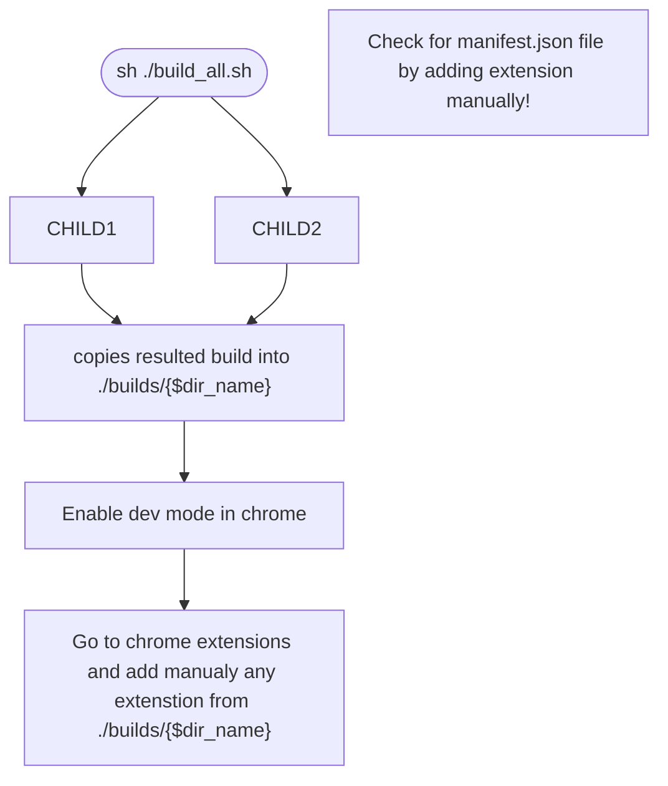

# Chrome extensions (not published in Chrome store)

  

```mermaid

flowchart TD
  ENTRY(["sh ./build_all.sh"])
  ENTRY --> CHILD1
  ENTRY --> CHILD2
  CHILD1 --> BUILD["copies resulted build into ./builds/{$dir_name}"]
  CHILD2 --> BUILD
  BUILD --> CHROME_DEV_MODE["Enable dev mode in chrome"]
  CHROME_DEV_MODE --> CHROME_EXT["Go to chrome extensions and add manualy any extenstion from ./builds/{$dir_name}"]
  WARNING["Check for manifest.json file by adding extension manually!"]
```